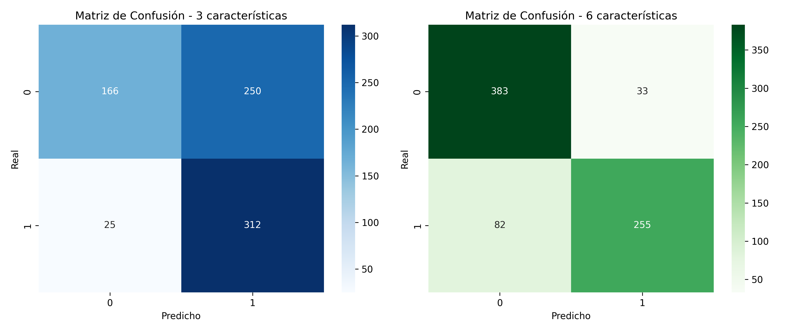

# 🧠 Brain Tumor App – Clasificador Web con Perceptrón Simple

Este proyecto implementa una **aplicación web interactiva** para predecir la presencia de un tumor cerebral a partir de características estadísticas derivadas de imágenes médicas. Utiliza un **modelo de Perceptrón Simple** entrenado con el dataset [Brain Tumor (Kaggle)](https://www.kaggle.com/datasets/jakeshbohaju/brain-tumor).

---

## 🧪 Requisitos Generales

Antes de comenzar, asegúrate de tener instaladas las siguientes herramientas:

### 🔹 Para el backend (Flask):
- Python 3.8 o superior
- pip

### 🔹 Para el frontend (React):
- Node.js (18.x o superior)
- npm

Puedes verificar si los tienes ejecutando:

```bash
python --version
pip --version
node -v
npm -v
```

Descargas recomendadas:
- [Python](https://www.python.org/downloads/)
- [Node.js](https://nodejs.org/)

---

## 📁 Estructura del Proyecto

```
brain-tumor-app/
├── backend/                    # API Flask con modelo Perceptrón
│   ├── Brain Tumor.csv
│   ├── api_modelo.py
│   ├── modelo_perceptron.pkl
│   └── requirements.txt
│
├── frontend/                   # Interfaz React + Tailwind
│   ├── src/
│   │   ├── App.jsx
│   │   ├── index.js
│   │   ├── assets/
│   │   └── components/
│   ├── tailwind.config.js
│   ├── package.json
│   └── vite.config.js
```

---

## 🚀 ¿Cómo ejecutarlo localmente?

### 🔹 Backend (Flask + Perceptrón)

```bash
cd backend
pip install -r requirements.txt
python api_modelo.py
```

Esto:
- Entrena el modelo automáticamente si no existe
- Expone una API en: `http://localhost:5000/api/predict`

---

### 🔹 Frontend (React + Tailwind)

```bash
cd frontend
npm install
npm run dev
```

La app web estará disponible en: `http://localhost:5173`

---

## ✨ Características

- Clasificación binaria: Tumor (`1`) o No Tumor (`0`)
- Interfaz responsiva con Tailwind
- Visualización de:
  - Datos del dataset
  - Rangos típicos por clase
  - Matriz de confusión y accuracy del modelo
- API de predicción en tiempo real vía Flask

---

## 🧠 Ejemplo de predicción

Entrada enviada al backend:

```json
{
  "Mean": 12.4,
  "Variance": 1032.1,
  "Standard Deviation": 36.5,
  "Entropy": 0.008,
  "Skewness": 5.9,
  "Kurtosis": 42.7
}
```

Respuesta esperada:

```json
{
  "prediction": 1,
  "label": "Tumor cerebral detectado"
}
```

---

## 📷 Vista previa

| Dataset Preview                        | Matriz de Confusión                |
|----------------------------------------|------------------------------------|
|  |  |

---

## 📄 Licencia

Este proyecto fue desarrollado con fines educativos por Erick Alejandro Bejarano Mosquera.  
Puedes modificarlo libremente citando su origen. Dataset utilizado bajo licencia de Kaggle.

---

## 📬 Contacto

¿Preguntas o sugerencias?  
Escríbeme a: **erickbejarano236234@correo.itm.edu.co**
